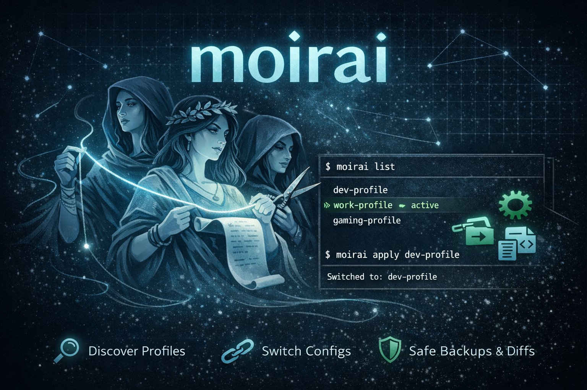

# moirai



Moirai is a CLI tool for managing oh-my-opencode configuration profiles. It discovers profile files, switches the active config by updating a symlink, and can help with backups and diffs so you can move between setups safely.

If you keep multiple oh-my-opencode profiles for different workflows, moirai gives you a small, focused interface to list and apply them without hand-editing files.

## Installation

Download the latest release from GitHub Releases, then install it manually:

```
chmod +x moirai-<os>-<arch>
mv moirai-<os>-<arch> /usr/local/bin/moirai
```

## Release (local snapshot)

Build a local snapshot release with GoReleaser:

```
goreleaser release --snapshot --clean
```

## CI (local)

Run the full CI suite locally:

```
task ci
```

## Smoke tests

Run end-to-end smoke checks in an isolated temp config directory:

```
task smoke
```

The smoke task runs destructive scenarios against a temporary `XDG_CONFIG_HOME`, so it never touches real user config files.

## Release process

1) Run CI locally:

```
task ci
```

2) Create a release tag locally:

```
task release:patch
```

(Or use `task release:minor` / `task release:major`.)

3) Publish the prepared tag:

```
task release:publish VERSION=vX.Y.Z
```

4) GitHub Actions runs automatically and a GitHub Release appears with assets and checksums.

## Basic usage

List available profiles and show the active one:

```
moirai list
```

Switch to a profile:

```
moirai apply <profile>
```

## Config location

Moirai reads profiles from `~/.config/opencode/`.

## Safety note

Moirai treats the active config as a symlink to a profile file and uses backups when making changes. Review backups and symlinks before restoring or applying profiles.
